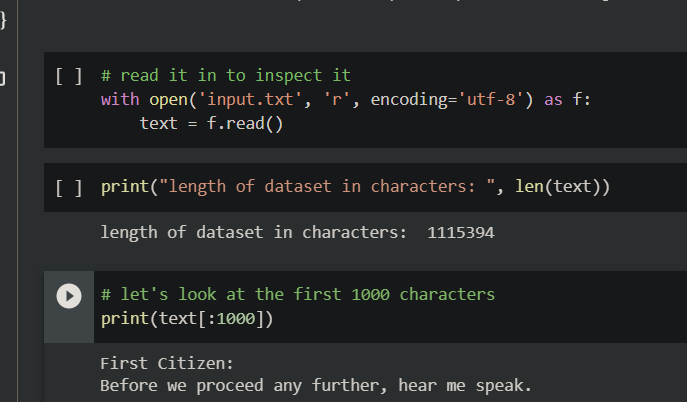
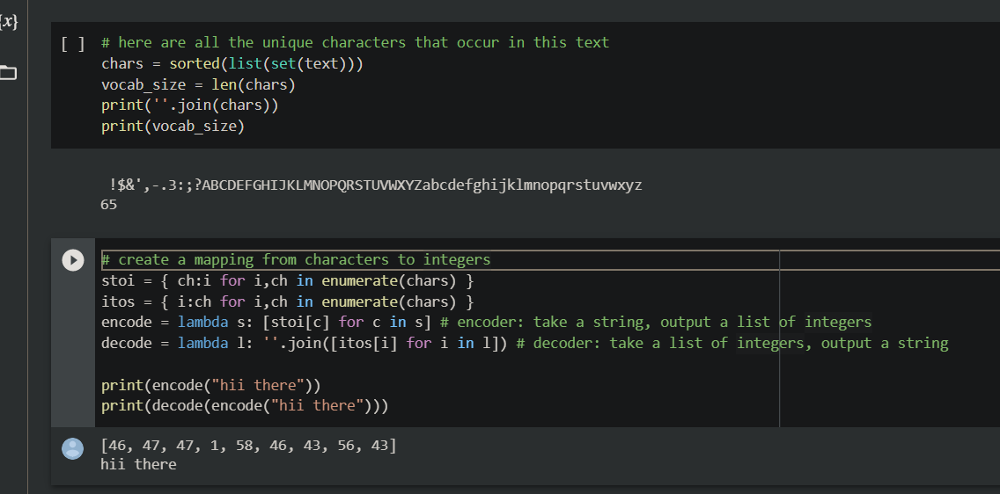
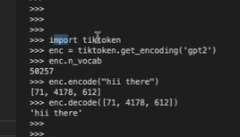
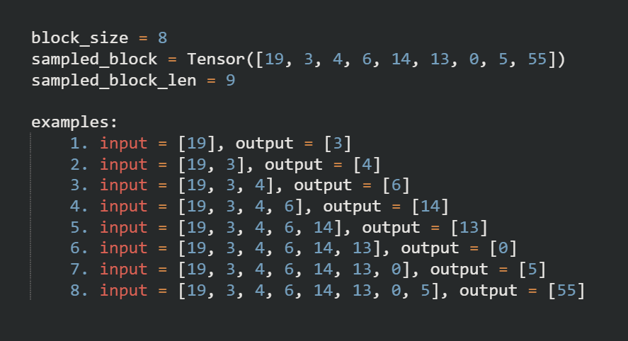
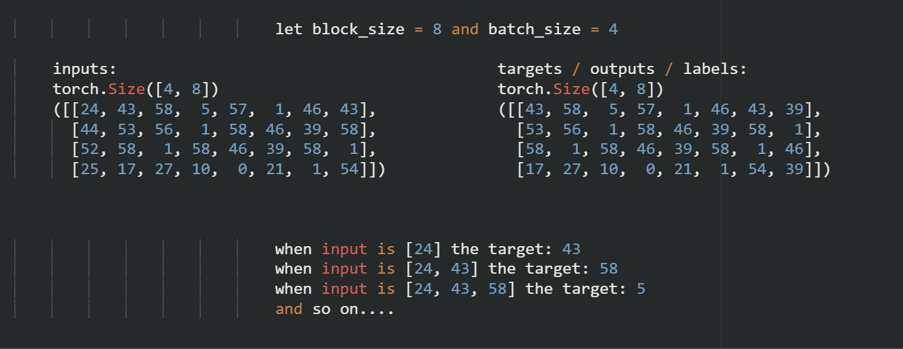
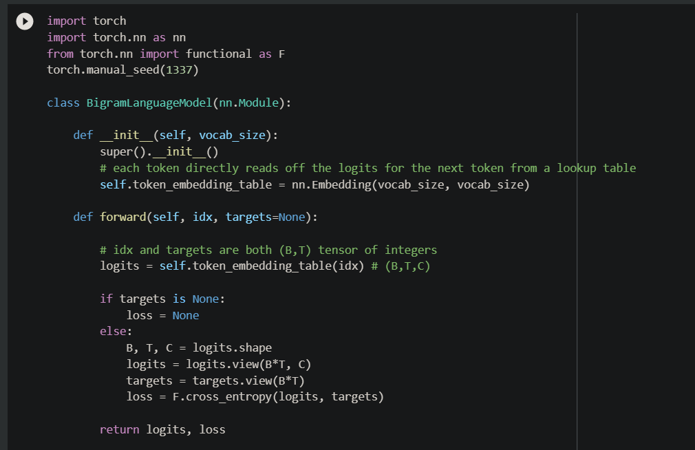
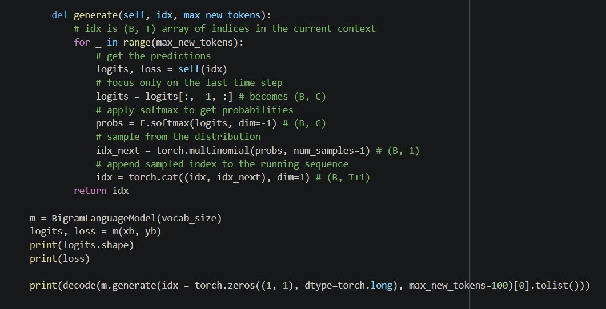

# Creating ChatGPT from scratch

## *Introduction*

ChatGPT allows us to interface with an AI using a prompt that return us some very accurate NLP responses. `Example: Write a Haiku about birds`. This AI generares words sequentially from left to right. It is a probabalistic system that can give us different answers for the same prompt.

This is what we call a ==**language system**== as it models the sequence of words (or characters, tokens) using its inherent semantic knowledge of coherent sentence format (it knows how words follow each other in a sentence). From the perspective of the model, we give it the start of the sequence (i.e. the prompt) and it completes the sequence as it response.

### Under the Hood

the underlying technology that makes ChatGPT possible is a ==**transformer**==. First described in 2017 in the paper [Attention Is All You Need](../papers/1706.03762.pdf) by Google. GPT stands for *Generatively Pre-trainded Transformer* thus the transformer is the inherent neural network that does all the heavy lifting of the chatbot.

The transformer model was initially built for machine translation, but in the half-decade after its release, it has taken over AI with minor changes to its Architecture. To understand the model better we need to look at the model architecture itself.

Initial model Architecture : 

### Working of the Model

ChatGPT is trained on billions of parameters, here we are goining to create a simple character-level transformer-based language system, trained on the much smaller toy dataset called the [Tiny Shakespeare Dataset](https://huggingface.co/datasets/tiny_shakespeare). This is text dataset containing all the works of Shakespear in a 1MB file.

The inherent working of the model is that for a prose given as : `As thou art to thyself: Such was the very armour he had on When he the ambitious Norway combated;` (a part of hamlet) the model should return something like (i.e. character sequences in the form of Shakespear) : `So frown'd he once, when, in an angry parle, He smote the sledded Polacks on the ice. 'Tis strange.` (rest of the prose).

The entire code for training such a transformer is given as : [NanoGPT](https://github.com/karpathy/nanoGPT) by Andrej Karpathy. All the code from this repo has been written by me while following alng with andrej karpathy's lecture.

## *Building the Model*

first we use the `wget` library to get the shakespear text data.

then we load the data into a variable called text, which is then sampled to see our data 

following this we construt a set of all possible characters that we might scan.

The next step involves ==**tokenization**== where the string inputs are converted into corresponding integer symbols using a mapping, as machines are trained to numerical data. Any text data used during training or evaluation is converted to a numerical sequence and process. Similarly, the output is converted from a numerical sequence to a character sequence to be shon to user finally. 

We are building a charater-level language model hence the tokenization will be done on each charater rather than a word or sentence. Most real-world implemenataions (such as [Google's SentencePiece](https://github.com/google/sentencepiece) and [PyTorch's tiktoken (used in GPT)](https://github.com/openai/tiktoken)) use a sub-word tokenization process. Where each word in not tokenized, rater it is broken into smaller parts that is tokenized, these parts still being larger than individual charaters. 

This process depends on the tradeoff between the size of our encoding / decoding mappings and the length of tokenized sentences. We can either have a long sequence of integers with a small library (mappings) or vica-vera. Various tokenizers offer different properties w.r.t. this tradoff.

To keep the current model simple we are only keeping character level encoding. Now that we have the tokenizer, we encode our entire text data and store the integer values in a `PyTorch Tensor`.

### Spliting the data

Now that we have our data in a tensor, we can split the data up into different sets. 90% of our data goes into the `Train Set`, the rest 10% makes the `Validation Set` (to check on overfitting).

In reality, due to computational limitations. We do not feed our entire dataset into the transformer in one go. Hence, we break up and sample our training data into little chunk and train on them one at a time. The maximum size of these chunks is called `block_size` and these chunks are called ==**Blocks**==.

Each integer token in our sampled block is used to train the next output in a cascading manner, as a langauage model predicts the next word the output of the model needs to be the most likely integer, given the previous integer array (of maximum size : block_size). Hence if our block size is 8, we sample a block of 9 tokens that are consecutive. This is because from 9 tokens, we get 8 examples. Instead of taking inputs as arrays of `block_size + 1`, we create a separate array with the output integer at position `n` given the input to be the first `n` integers of the sequence.

The transformer is given these examples to help it understand the context from as little as a single word (or in our case a single character) to the entire sentence. This is helpful later in inference during execution.

In a transformer, we would have multiple baches of sentences such as these, stacked up in a single Tensor which are independent of each other. This is done to leverge the paralleization power of GPUs.

Whereas, a ==**Batch**== is a set of such independent sequences that are processed in parallel by the model. So the training input of the transformer will be a matrix of `rows = batch_size` and each row being an `integer array of len = block_size`. An example for batch_size = 4 and block_size = 8 is given below: 

The above examples gives us the compact representation of in total 32 examples `(4 * 8 = 32)`.

### Constructing the Bigram Neural Network Model

The first thing we are going to do is to create a baseline model to build the transformer on. Hence, we first build a `Bigram Model`. For an in-depth into this model see this **makemore** series by Andrej Karpathy, the first episode is here : [building makemore](https://www.youtube.com/watch?v=PaCmpygFfXo&list=PLAqhIrjkxbuWI23v9cThsA9GvCAUhRvKZ&index=2).

In the video Andrej explains the creation of the `BigramLanguageModel` Class which is a subclass of `torch.nn.Module`. In the constructor we create an embedding table of size `(vocab_size, vocab_size)` i.e. if our vocab_size = 65, then the embedding table will be a matrix with 65 rows and 65 columns.

In the `forward` step we are predicting what comes next using a probability distribution, for each character in our vocabulary the embedding table has a corresponding array with the probabity of each charater in our vocabulary being the next in the sequence.

As no tokens talk to each other for this model. We have an individual representation for each unique character. Example: for token 5, we get the array at index 4 (index starts from 0) in the embeddings table. Which is a probabity distribution of the possible next word in the sequence i.e. 3: 50% prob, 27: 6% prob, 31: 2% prob, and so on...

This prediction distribution is called the ==**logits**== (also called `scores`) and is returned in the feed-forward step. The shape of logits is : `(B, T, C)` a.k.a. `(batch, time, channel)` a.k.a. `(batch_size, block_size, vocab_size)` i.e. for our example : `(4, 8, 65)`. Logits in Deep Learning are the values that we get from the model that would be fed into a `Softmax` or `ArgMax` layer to get our final predictions.

After making the predictions we evaluate our ==**loss function**==, this is only done if the **targets** are provided otherwise the loss is set to *None*. A good function to evalue our model is the `Negative Log Likelyhood` a.k.a. `Cross Entropy`. To use this we reshape our logits and targets as (BxT, C) & (BxT, 1) respectively. 

Now to generate outputs from our model we make a `generate` function. The job of this function is to extend the input `idx` of size (B, T) into outputs arrays of size (B, T+1)..(B, T+2)..(B, T+3)..and so on. Simply put, this function extends the input by generating the new sequence. In the function we loop till the maximum number of new generations we want this paramerter is stored in the `max_new_tokens` variable.

Inside each loop we get the predictions (from embeddings table) of our indicies i.e. logits and loss (not used here), this is done by executing the `forward` step in our class. From the logits we pluck out the last prediction beacause that is the prediction of what comes next. We convert the next prediction into prababilities using the `softmax` function. We sample a probability generated from the softmax function which then becomes the index of the generated character. This generation is finally appended into our indices and the next step of the loop is started to conduct all the above steps again till we generate a sequence of the sixe of `max_new_tokens`. Finally our indicies are returned which are decoded to get back the generated sequence.

### Training the model

The above model generates grabage values as we have not trained this, also in terms of the biram model at each step of the loop we input the entire character sequence which is not needed in a Bigram Model as it produces predictions by only seeing the last character in our indicies. But we make this general function for he future when we exten this model to a transformer that taken in the history of the sequence to produce coherent sequences.

To trin or model construct a basic training loop. Choosing to use the `AdamW Optimizer` we set our batch size to 32. Then in s loop: zero-out all the gradients from the previous step, conduct the backward step on our loss and conducting the optimizer step function. To finally get our loss at the end of training. 

Now we age going to extend this model so that the previous context (history) of the sequence plays a vital role in prdicting the next character, not ONLY the last character.

### Converting model to a script

Now we take all our code from the python notebook to a runnable script where most of our code remains the same with some minor changes.

We introduce some global variabes such as `device`, `eval_iters`. `device` to help run the model on GPU devices, if GPU device is available then we have to move the data to these devices on loading similarly we want to move the model parameters to the device as well when we create the model (example: moving the `nn.Embeding().weight` table to the device which stores the lookup table). This is done so that all the calculation be done on the GPU in a higly optimized manner.

We also want a less noisy version of esuring the loss, rather than just printing it every time, we want to stimate it using a `estimate_loss()` function which averages out the loss over multiple batches to give us a better idea of where the model is headed. This averaging out is done over a number of iterations which is stored in the `eval_iters` variable. Hence estimate_loss() averages the loss by multiple batches over the `train` and `validation` sets. 

NOTE: The `@torch.no_grad()` context manager decorator over the `estimate_loss()` function tells PyTorch that `.backward()` does not need to be called on anything inside the function.

NOTE: it is a good idea to switch the model model from `training` to `inference` where necessary as the training layers (example: `BatchNorm`, `Dropout`) behave differently in such different modes. This can be done by calling the `model.eval()` and `model.train()` methods.

## Example: Mathematical Trick in Self-Attention

To get an idea of creating optimaized attention operations in neural networks we are goinf to take a Toy Example. Where we define a random tensor of shape (B, T, C) where B=4, T=8, C=2. Currently all these 3 dimentions are not sharing information between each other.

To couple them in a particular way where the token at a position should not communicate with any future (next) token that is a Token at position 4 should not be connected to tokens 5 6, 7 etc (as these are future tokens in the sequence). Hence, the information flows only from the previous context to the current timestep.

The simplest way to do this is to take an average of all the previous steps that becomes a feature vector that summarizes the current context summary. This conversion (summation or averaging more precicely) is a very lossy conversion where all the spactial data is lost. We will explain how to brin this information back later.

Thus, what we are going to do is for every sequence in the B dimention we are going to calculate the average of the previous T tokens for each T^th^ token.

In the above example every row in the *orignal tensor* corresponds to a row in the averaged out tensor. The first rows in bot tensors are the same as they have no values behind them. In the second row `(0.1 + 0.2) / 2 = 0.15` as seen in the 2^nd^ row of the 1^st^ column of the average tensor. Similarly, the 3^rd^ row of the 1^st^ column of the average tensor would be `(0.1 + 0.2 + 0.3) / 3 = 0.2` and so on...

But the above process is extremly inefficient. The trick to do the above process efficently is to use matrix mutiplication. More specifically, if we multiply an array of size (T, T) where the array is a lower triangle as well as all the rows sum upto 1, then the resultanat matrix will be our average matrix. Because this ooperation is done using matrixes, we can leverage the power of parellization through GPUs. Hence, using Batch Matrix multiply we can do this weighted aggregation using the (T, T) array.

## Code Cleanup

Now that e have the vocab size as a global constructor, we do not need to pass it through the constructor anymore. We will add another global variable `n_embed` that specifies the number of embedding dimentions. This will now become the 2^nd^ dimention of the enbedding table of dimentions `(vocab_size, n_embed)`.

Now the embeddings table doesnot return logits directly instead we get `tok_emb` (token embeddings) and a linear layer will be present between the `logits` and the `tok_emb` variables. Now we need to make a `self.lm_head` linear layer in the constructor. We will get our logits when we pass the token embeddings through the lm_head.

New we create a positional encoding table in the constructor as well named `self.position_embedding_table` wich is an embedding table of size `(block_size, n_embed)`. We use this in the forward step to get the `pos_emb` variable.

Finally the `pos_emb` and `tok_emb` matricies get concatanated to create the final result

## Extending the Bigram Model

### Crux of Self-Attention

Self-attention solves the problem of getting the contextual data from the past in a data dependent way. This done by emiting 2 vectors: ==**Query**== and ==**Key**== at every single node / token. Query vector signifies *what am I looking for?* whereas the Key ector signifies *what do I contain?*. We get our affinities in the sequence by doing a dot product between the keys and the query vectors. So if the key and the query vectos are similarly directional we ill have higher affinity (cosine property).

After transposing the key vector and doing the dot product, we will get a `(B, T, T)` matrix i.e. the affinities that will become our weights. FInally, we will create a value vector as well wich will become our outut vector after we dot-product our weights and values.

### Further Information

#### NOTE #1

Self-Atention is a communication mechanism. Like a directed node with multiple in-edges (each edge has some vector of information), where the weighted sum of these edges is attention. this is done in a data-dependent manner i.e. depending on data that is present in the incomming nodes at that moment.

#### NOTE #2

Attention has no notion of space. Attention simply acts over a set of vectors, by defaul these vectors do not cntain their positional data. Hence, positional encoding need to be added separately to get generations that are coherent (keep the semantic understanding of the positions of words)

#### NOTE #3

All information across the different batches are processed separately. Hence, the information in the block of batch 1 does not effect the training of batch 2 or 3 and vice-versa.

#### NOTE #4

In the case of language models, we keep a constranint on the data that future tokens do not communicate with tokens from the past. But this might not always be the case. In many cases, for example, if we want a model that does sentiment analysis or topic modeling. Our ==**encoder**== model should take in information from the past and future tokens.

We have created a ==**decoder**== for our Language Model as it has an autoregressive structure where it is decoding language

#### NOTE #5

Attention vs Self-Atention vs Cross-Attention

When `keys`, `queries` and `values` all come from the same source, it is called ==**Self-Attention**==.

For a case where `queries` come from the same source but the `keys` and `values` come from different external sources (encoder blocks) this type of attention is called ==**Cross-Attention**==

#### NOTE #6

`"Scaled"` Attention is when we divide our weights (`wei`) by the root of the `head_size` as a normalization operation. This is to make the `wei` matix have unit variance and 0 mean calulated from input matrices that are of unit variance and 0 mean themselves, such as `Q` (queries) and `K` (keys).

This is important as `wei` is given as input to a `Softmax` funcion, which converges to `one-hot vectors` (array with a single 1 and all other fields as 0) if the input array does not have diffused values (having very positive and very negative (sharpened) values).

This normalization would help the model from getting extremly peaky.

### Creating Self-Attention Block Class

Using our knowledge of self-attention. We create a new class `Head()` that handles all the self-attention operations. When this class is initialized we create the internal `Linear` layers (without bias) of `key`, `query` and `value`. We also create a buffer named `trill` where we stor our bottom triangle matrix of size (T, T).

In the `forward()` function of this class first we get the shape of our input `x` i.e. `B, T, C`. We send our input through the linear layers of `key` and `query` linear layers to get `k` and `q` variables. Then we get our weights by geeting the dot product of `q` and `k` (transposed along T and C axis) and finally normalizing by C (channels) (scaled attention).

We alter our weights using a `maked_fill` from our previously define `trill buffer matriz` to make sure that every node only communicates with the past and not the future.

We pass our weights through a `Softmax` layer along the last axis, as well as perform the weighted aggregation of the `values` to get the `v` array. Finally, the dot product of weights `wei` (of shape: (B, T, T)) and values `v` (of shape: (B, T, C)) are stored in a variable called `out`. The `out` tensor is returned as the result.  

### Updating Bigram Language Model Class

In the `__init__()` class of the model we intoduce a new local parameter called `sa_head`(self-attention head) which is the instantiated `Head` class with `n_embed` as the input depicting head size.

In the `forward()` step once the positional and token embedding are encoded into the input `x` variable, we pass that through our `sa_head` function to add self attention to that block. The output to this is sent to our langauge modeling head (`lm_head`) to create the logits.

Also, in our `generate()` funtion we crop our context to make sure that our embeddings donot run out of scope with respect to the input.

NOTE: we decreae the `learning_rate` as the self-attention model cannot tolerate huge changes in weights.

### Multi-Head attention

Here we calcuate multiple attention blocks in parallel and concaternate the product. We create a new `MultiHeadAttention` class. In it's `__init__()` function we take in `num_heads` and `head_size` as inputs and create a module list of `num_heads` length filled with instantiated `Head` classes each of size `head_size`. This list is stored in a variable called `heads`.

In the `forward` method we het the input `x` which we send to each head in the odule list and concatenate the result which is sent as the result.

In the `__init__()` method of the `BigramLanguageModel` Class we update the `sa_head`(self-attention head) parameter. Where earlier it was the instantiated `Head` class, now is the instantiated `MultiHeadAttention` Class with its first arg as the `num_heads` and the second arg as the `n_embed` divided by `num_heads` (number of communication channels are conserved).

### Adding FeedForward Layer

In our model the token looked at each other but did not get a chance to actually learn from the text passes into them. Hence we add a neural net to add and extend computation in our decoder transformer.

We add simple multi-layer perceptron to increase computation on a per-nodel level. We do this by adding a `FeedForward` class. where the `__init__()` has a `net` parameter whch is a single Sequential layer with `Linear` and `ReLU` layers. In the `forward()` step we execute the `net` parameter and return the results.

In the `__init__()` method of the `BigramLanguageModel` Class we define a new `ffwd` parameter with is the instantiation of the `FeedForward` Class. This `ffwd` arameter is called directly after the self attention head `sa_head()`.

## Creating Transformer Block

We now finally create a `Block` class which interspeces communication and comutation to create poweful models. The communication is done in the `MultiHeadAttention` class and the computation is done using the `FeedForward` class. This process is done independently on all the tokens.

The relation between the embeddings (`n_embed`) and attention heads (`n_head`) are:

$$ HeadSize * NumberOfHeads = NumberOfEmbeddings  $$

### Optimizing the Model

Deep neural netwoks suffer from optimization issues, to counterac these the transformer uses 2 main ideas:

- **Residual Connections** or **Skip Connections**
- **LayerNorm**

In skip connections the gradiends are added from computation to the orignal values. Addition distributes gradients equally to both of its pathways. This makes the gradients from the loss skip directly to the input unimeded, rather than going through all the aditional comutation of the transformer.

hence, in the `forward()` step `x = self.sa(x)` becomes `x += self.sa(x)`, similar to how `x = self.ffwd(x)` becomes `x += self.ffwd(x)`. We also add a projection (`proj`) pathway to our `MultiHeadAttention` and `FeedForward` classes.

### OverFitting (LayerNorm)

Our `Validation` loss begins to get ahead of our `Train` loss which signifies that our model is overfitting on our data. To alleviate this we use LayerNorm, this is smimilar to BatchNorm where we normalize accross the Batch dimention to create a ==**Unit Gaussian Distribution**== (Zero Mean and Unit Standard Deviation).

LayerNorm is defined in PyTorch itself and unlike when the transformer architecture was initially developed and the `LayerNorm` was applied just after each operation, now the `LayerNorm` is applied just before each operation (`Pre-Norm Formulation`) as well as at the end of the transformer.

### Code Cleanup #2

In order to scale up the model we need to add some additional config variables. `n_layer` is a variable that specifies how many block layers do we need. `n_head` is a variable that specifies the number of attention heads in each layer of the `Block` class. We also added `Dropout` regularization to our `FeedForward` class to alleviate overfitting.

## Conclusions
